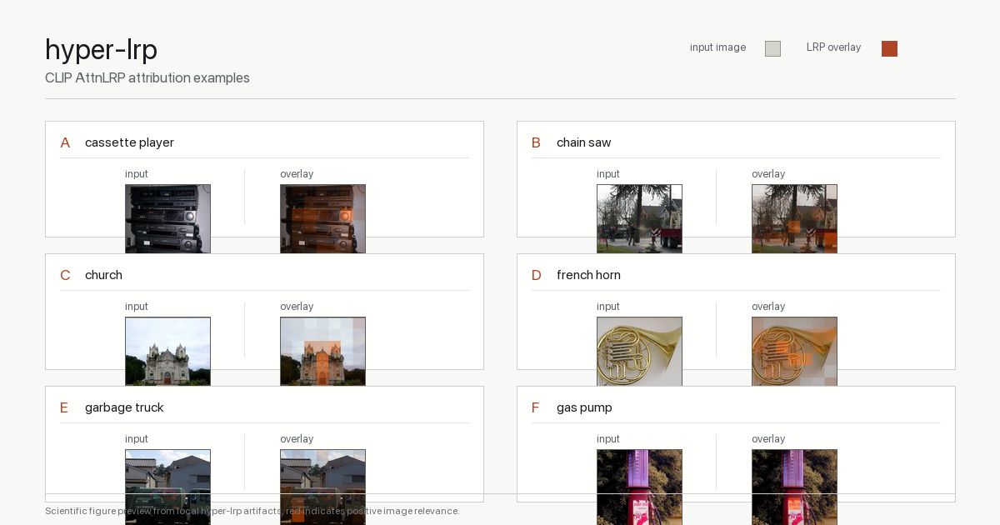

# hyper-lrp

[](assets/readme/hyper-lrp-hero.png)

`hyper-lrp` is a small PyTorch-first LRP package built for the exact gap in HyperView:

- Hugging Face CLIP needs a gradient-capable path, not the default torch-free embedding runtime.
- Users should be able to add their own model by writing a thin adapter rather than rebuilding the attribution stack.

The current implementation is built around a reusable scorer/adapter interface and one built-in runtime path:

- **Hugging Face CLIP** uses AttnLRP (ICML 2024) via the LXT efficient framework with Zennit Gamma denoising for ViT-quality heatmaps. The full AttnLRP pipeline includes: `divide_gradient` on attention Q/K/V, identity rule on LayerNorm and activations, Gamma rules on Conv2d (patch embedding) and Linear layers, and patch-level pooling to eliminate sub-patch speckle.

## What Is Included

- A reusable explainer core that turns an image similarity scorer into an LRP heatmap.
- Built-in adapters for:
	- Hugging Face CLIP (`openai/clip-vit-base-patch32` by default)
- A generic adapter shape for custom models.
- A CLI for smoke testing and artifact export.

The package currently ships **one built-in adapter: `hf-clip`**. HyCoCLIP, MERU, and other model families should be added as separate adapters instead of being folded into the core explainer.

## Install

```bash
cd hyper-lrp
uv sync --extra dev
```

For HyperView integration in this workspace, install the package into HyperView's existing environment:

```bash
cd ..
uv pip install -e ./hyper-lrp
```

## Dependencies

The runtime dependency surface is intentionally small:

- `torch`, `transformers`, and `Pillow` for CLIP model loading and image preprocessing.
- `lxt` and `zennit` for AttnLRP and Gamma-rule propagation.
- `numpy` for heatmap processing and saved artifacts.

`transformers` is pinned to `4.52.4` because the current LXT AttnLRP integration is not compatible with the `transformers 5.x` API. Optional research dependencies such as `timm`, `torchvision`, `omegaconf`, `loguru`, and direct `huggingface-hub` usage are not part of the shipped `hf-clip` adapter and should live in future extras only when an adapter actually imports them.

## Quick start

```bash
cd hyper-lrp
uv run hyper-lrp explain \
	--adapter hf-clip \
	--image path/to/your-image.jpg \
	--prompt "a photo of a cat" \
	--output-dir ./artifacts/clip-demo
```

The command writes:

- `input.png`: the processed CLIP input image.
- `overlay.png`: the signed relevance overlay.
- `heatmap.npy`: the normalized signed heatmap.
- `result.json`: score and metadata.

## Writing a custom adapter

The package is intentionally adapter-driven. A custom adapter only needs to provide:

- which module namespace should be monkey-patched by LXT
- how to preprocess an input image into `pixel_values`
- a scorer module that maps `pixel_values -> scalar score`

The scorer can explain logits, cosine similarity, hyperbolic distance, or any other scalar target that is differentiable with respect to the image input.

## Repository Hygiene

- `artifacts/`, `checkpoints/`, `outputs/`, `vendor/`, and `context/` are ignored by the standalone repo.
- The README hero image is the only curated demo artifact intended to ship.
- Research notes live under `context/` and should not be pushed with a clean public package unless they are intentionally promoted into docs.

## Notes

- LRP remains subject to upstream patent and license constraints. Review those before commercial use.
- The package computes image-side relevance. Text features are precomputed without gradients.

## Validation checks

Use these checks while developing or changing the CLIP AttnLRP path:

1. Patch integrity (unit tests)

```bash
cd hyper-lrp
uv run --with pytest python -m pytest tests/test_clip_attnlrp.py -q
```

2. Runtime mode verification

Run an explanation and verify `result.json` contains:

- `metadata.backend_mode = "attnlrp-efficient-clip"`
- `metadata.lrp_mode = "attnlrp-efficient"`
- `metadata.gamma_conv` and `metadata.gamma_linear` (Zennit Gamma values)

3. Prompt sensitivity sanity check

On the same image, compare prompts like `"a photo of a cat"` vs `"a photo of a truck"` and verify:

- score decreases for the mismatched prompt
- heatmaps are not identical
- center/outer relevance ratio > 1.0 for reasonably centered subjects
